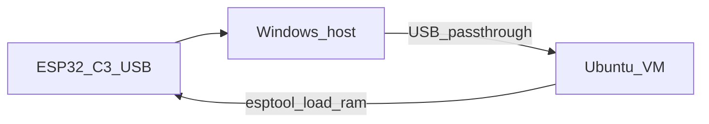

# mTower on ESP32-C3 Super Mini

# Contents
1. [Introduction](#1-introduction)
2. [Prerequisites](#2-prerequisites)
3. [Build](#3-build)
4. [Flash and run (native Linux)](#4-flash-and-run-native-linux)
   - 4.1 [Install esptool in a project venv](#41-install-esptool-in-a-project-venv-recommended)
   - 4.2 [Find the serial port and flash](#42-find-the-serial-port-and-flash)
5. [Flash from Ubuntu in VirtualBox on Windows](#5-flash-from-ubuntu-in-virtualbox-on-windows)
6. [Expected console output](#6-expected-console-output)
7. [Phase 1 notes](#7-phase-1-notes)
8. [Troubleshooting](#8-troubleshooting)

## 1. Introduction

These instructions build and run **mTower Phase 1** on the
[ESP32-C3 Super Mini](https://www.espressif.com/en/products/socs/esp32-c3)
board: FreeRTOS Normal World, UART/USB console, and a `hello_world` task.
Secure World / GP TEE (PMP isolation) is deferred to Phase 2.

HAL is a thin ESP32-C3 BSP under `arch/riscv32/esp32c3/src/esp-hal/`
(register-level UART / USB-Serial-JTAG, SYSTIMER, GPIO). Freedom Metal is
**not** used.

## 2. Prerequisites

- Linux host (or Ubuntu guest) with `make` and a RISC-V GCC that can target `rv32imc`:
  - **Default defconfig:** system `riscv64-unknown-elf-gcc` (`apt install gcc-riscv64-unknown-elf`)
  - Ubuntu’s package is often built **without newlib**; this port includes a
    minimal `esp-hal/libc_min` so the image still links (`-ffreestanding -nostdlib`)
  - Prefer `picolibc-riscv64-unknown-elf` or Espressif `riscv32-esp-elf` when available
  - **Or** select `GCC_VERSION_ESP_RISCV32` in menuconfig when `riscv32-esp-elf-gcc` is on `PATH`
- Optional: local ESP-IDF at `../esp-idf` relative to mTower (headers only;
  not required for Phase 1 BSP)
- `esptool` for flash (see install steps below) — not required to **compile**
- USB data cable to the Super Mini (USB-Serial-JTAG; use a cable that carries data, not charge-only)

## 3. Build

```sh
cd mTower_current
make PLATFORM=esp32c3_supermini create_context
make toolchain   # no-op for host toolchain; documents CROSSDEV
make
```

Artifacts:

- `mtower_ns.elf` / `mtower_ns.bin` — FreeRTOS image (SRAM layout)
- `mtower_ns_ram.bin` — ESP image for `load-ram` (created by `make flash`)
- `build/nonsecure/.../nonsecure/bl33.elf` — same image under the build tree

## 4. Flash and run (native Linux)

### 4.1 Install esptool in a project venv (recommended)

Modern Ubuntu/Debian mark the system Python as **externally managed** (PEP 668),
so `pip install --user esptool` fails with `externally-managed-environment`.
Use a local virtualenv instead:

```sh
cd mTower_current
sudo apt install -y python3-venv python3-pip
./tools/setup-esptool-venv.sh
```

This creates `.venv-esptool/` (gitignored) and installs packages from
`requirements-esptool.txt`. Verify:

```sh
.venv-esptool/bin/esptool version
# esptool v5.x
```

Activate optionally:

```sh
source .venv-esptool/bin/activate
```

### 4.2 Find the serial port and flash

```sh
ls -l /dev/ttyACM* /dev/ttyUSB* 2>/dev/null
# Super Mini USB-Serial-JTAG is usually /dev/ttyACM0

# make flash: converts ELF -> ESP RAM image, then load-ram (not raw write to 0x0)
make flash ESP_PORT=/dev/ttyACM0

# Explicit steps:
.venv-esptool/bin/esptool --chip esp32c3 elf2image --ram-only-header \
  -o mtower_ns_ram.bin mtower_ns.elf
.venv-esptool/bin/esptool --chip esp32c3 --port /dev/ttyACM0 --baud 460800 \
  --no-stub load-ram mtower_ns_ram.bin
```

`--no-stub` is required: the flasher stub lives in IRAM at `0x40380000`, which
is where this Phase 1 image is linked.

Open a serial console at **115200** 8N1 (second terminal):

```sh
# pick one
picocom -b 115200 /dev/ttyACM0
# or:  screen /dev/ttyACM0 115200
# or:  minicom -D /dev/ttyACM0 -b 115200
```

Do **not** `write-flash 0x0 mtower_ns.bin` — that is a raw SRAM dump, not an ESP
boot image, and will overwrite the flash bootloader slot.

---

## 5. Flash from Ubuntu in VirtualBox on Windows

Goal: build inside the Ubuntu VM, pass the ESP32-C3 USB device into the guest,
then run `esptool` / `make flash` from Ubuntu.



### 5.1 One-time setup on Windows (host)

1. Install [Oracle VirtualBox](https://www.virtualbox.org/) and the matching
   **VirtualBox Extension Pack** (required for USB 2.0/3.0 passthrough).
2. Shut down the Ubuntu VM completely (not only save state).
3. In VirtualBox Manager → select your Ubuntu VM → **Settings**:
   - **System → Motherboard:** enable **I/O APIC** if not already on.
   - **USB:**
     - Enable USB Controller
     - Prefer **USB 3.0 (xHCI)** (ESP32-C3 Super Mini is usually USB FS device;
       USB 2.0 EHCI also works on many hosts)
4. Optional but recommended: create a USB **filter** so the board auto-attaches
   when plugged in:
   - Still under **Settings → USB →** click the **+** (Add filter from device)
   - Plug the Super Mini into Windows first so it appears in the list
   - Select a device named like **Espressif**, **USB JTAG/serial**, **CP210x**,
     or **USB Single Serial** (name varies by board/cable)
   - Or add a blank filter and set **Vendor ID** `303A` (Espressif USB-Serial-JTAG)

### 5.2 Drivers on Windows

- Boards that expose **Espressif USB-Serial-JTAG** often need no extra driver on
  modern Windows 10/11 (WinUSB).
- If Windows only shows an unknown device, install Espressif’s USB drivers or
  use [Zadig](https://zadig.akeo.ie/) to bind WinUSB for the interface you will
  pass through.
- While flashing from the VM, **do not** keep a Windows serial app
  (Arduino IDE, PuTTY, ESP-IDF Monitor) open on the same COM port — Windows
  will hold the device and VirtualBox cannot claim it.

### 5.3 Attach the board to the Ubuntu guest

1. Start the Ubuntu VM.
2. Plug the ESP32-C3 into the PC with a **data** USB cable.
3. In the VirtualBox window menu: **Devices → USB** → check the Espressif /
   USB JTAG / serial device so it shows a checkmark (owned by the guest).
4. In Ubuntu, verify the device appeared:

```sh
lsusb
# Expect something like: ID 303a:1001 Espressif USB JTAG/serial debug unit
# (exact product id can differ)

dmesg | tail -30
# Look for cdc_acm / ttyACM0 lines

ls -l /dev/ttyACM* /dev/ttyUSB*
```

Typical device node: **`/dev/ttyACM0`**.

5. Permission to open the port (pick one):

```sh
# Temporary (until reboot)
sudo chmod 666 /dev/ttyACM0

# Permanent: add your user to dialout, then log out/in
sudo usermod -aG dialout $USER
# then reboot or re-login
```

### 5.4 Install esptool inside Ubuntu (venv)

Do **not** use bare `pip install --user` on Ubuntu 24.04+ (PEP 668). Use the
project venv:

```sh
cd ~/riscv_study/mTower_current   # adjust to your path
sudo apt install -y python3-venv python3-pip
./tools/setup-esptool-venv.sh
.venv-esptool/bin/esptool version
```

### 5.5 Build (in the VM) if you have not already

```sh
cd ~/riscv_study/mTower_current   # adjust to your path
make PLATFORM=esp32c3_supermini create_context
make
ls -l mtower_ns.elf mtower_ns.bin
```

### 5.6 Flash from the VM

Put the chip in a flashable state if needed:

- For many Super Mini boards, a normal USB plug is enough.
- If esptool cannot connect: hold **BOOT** (GPIO0 / IO9 on some Super Minis),
  tap **RESET**, release **BOOT**, then run esptool again.

Flash (RAM load — best for Phase 1):

```sh
cd ~/riscv_study/mTower_current

# Uses .venv-esptool automatically when present
make flash ESP_PORT=/dev/ttyACM0 ESP_BAUD=460800

# Or explicit (ESP image, magic 0xE9 — not raw ELF):
.venv-esptool/bin/esptool --chip esp32c3 elf2image --ram-only-header \
  -o mtower_ns_ram.bin mtower_ns.elf
.venv-esptool/bin/esptool --chip esp32c3 --port /dev/ttyACM0 --baud 460800 \
  --no-stub load-ram mtower_ns_ram.bin
```


Use a lower baud (e.g. `460800` or `115200`) if VirtualBox USB is unreliable at
`921600`.

### 5.7 Serial monitor from Ubuntu (or from Windows)

**Option A — monitor inside the VM** (simplest while USB is passed through):

```sh
# Close any other program using /dev/ttyACM0 first
picocom -b 115200 /dev/ttyACM0
# exit picocom: Ctrl-A then Ctrl-X
```

Install picocom if needed: `sudo apt install -y picocom`.

**Option B — flash from VM, monitor on Windows:**

1. After `load_ram`, detach USB from the VM: **Devices → USB** → uncheck the device.
2. On Windows, open the new **COM** port in PuTTY / Arduino Serial Monitor at
   **115200**.
3. Note: detaching may reset the board; with RAM-only images the firmware is
   lost on reset — keep the device attached to the VM for Phase 1 bring-up.

### 5.8 Alternative: flash from Windows, build in the VM

If USB passthrough is painful:

1. In Ubuntu, copy the image out to a shared folder, e.g.
   `/media/sf_Shared/mtower_ns.elf` (enable Guest Additions shared folders).
2. On Windows, install Python + esptool in a venv (or `pipx install esptool`):
   ```bat
   python -m venv .venv-esptool
   .venv-esptool\Scripts\pip install esptool
   ```
3. Flash from PowerShell/CMD (replace `COMx`):
   ```bat
   .venv-esptool\Scripts\esptool --chip esp32c3 elf2image --ram-only-header -o mtower_ns_ram.bin mtower_ns.elf
   .venv-esptool\Scripts\esptool --chip esp32c3 --port COM5 --baud 460800 --no-stub load-ram mtower_ns_ram.bin
```
4. Monitor with PuTTY on the same COMx at 115200.


### 5.9 Checklist (VirtualBox)

- [ ] Extension Pack installed; USB 2.0/3.0 enabled on the VM
- [ ] Board not open in a Windows COM app
- [ ] Device checked under **Devices → USB** in the VM window
- [ ] `lsusb` shows Espressif `303a:...` in Ubuntu
- [ ] `/dev/ttyACM0` exists; user in `dialout` (or chmod)
- [ ] `mtower_ns.elf` built; `.venv-esptool/bin/esptool version` works
- [ ] `make flash ESP_PORT=/dev/ttyACM0` succeeds
- [ ] Serial at 115200 shows the hello banner

## 6. Expected console output

```
+---------------------------------------------+
|  mTower ESP32-C3 Super Mini (Phase 1)       |
|  FreeRTOS Normal World                      |
+---------------------------------------------+
mTower ESP32-C3 Super Mini: hello_world #0
mTower ESP32-C3 Super Mini: hello_world #1
...
```

LED on GPIO8 toggles each second (if wired on your Super Mini variant).

## 7. Phase 1 notes

- Scheduling is **cooperative** (`configUSE_PREEMPTION=0`); OS ticks advance
  from the idle hook via SYSTIMER polling (no CLINT / interrupt matrix yet).
- `CONFIG_APPS_HELLO_WORLD` enables a stub task that notes TEE Client API is
  unavailable until Secure World (Phase 2).
- Platform flag: `PLATFORM=esp32c3_supermini`
- `load-ram` images disappear after power-cycle / hard reset

## 8. Troubleshooting

| Symptom | What to try |
|--------|-------------|
| No `/dev/ttyACM*` in Ubuntu | USB not passed through; enable Extension Pack; Devices → USB → select board; try another cable |
| `Permission denied` on port | `sudo usermod -aG dialout $USER` and re-login, or `sudo chmod 666 /dev/ttyACM0` |
| `Could not open /dev/ttyACM0` | Another process holds it (picocom/modemmanager); kill it or `sudo systemctl stop ModemManager` |
| esptool: failed to connect | Hold BOOT, tap RESET, retry; lower baud; check `lsusb` still lists the chip |
| Device keeps disconnecting in VM | Switch USB controller 2.0 ↔ 3.0; use a powered hub; lower `ESP_BAUD` |
| Windows grabs the device again | Close Windows serial tools; re-check Devices → USB in VirtualBox |
| `externally-managed-environment` | Use `./tools/setup-esptool-venv.sh`, not system `pip install --user` |
| `esptool.py: command not found` | Run `./tools/setup-esptool-venv.sh`; use `.venv-esptool/bin/esptool` or `make flash` |
| `Invalid firmware image magic=0x7f` | You passed a raw ELF; use `make flash` (runs `elf2image --ram-only-header` then `load-ram`) |
| Stub overlap / can't load at `0x40380000` | Use `--no-stub` (already in `make flash`); stub flasher uses the same IRAM |
| Board won't boot after flash to 0x0 | Earlier `write_flash` of raw `.bin` wiped bootloader slot; ROM USB download still works — use `make flash`, or reflash ESP-IDF bootloader+app |
| Flash OK, no serial text | Wrong baud (use **115200**); confirm USB-Serial-JTAG vs external UART; try `dmesg` after flash |

[build.md]: build.md
